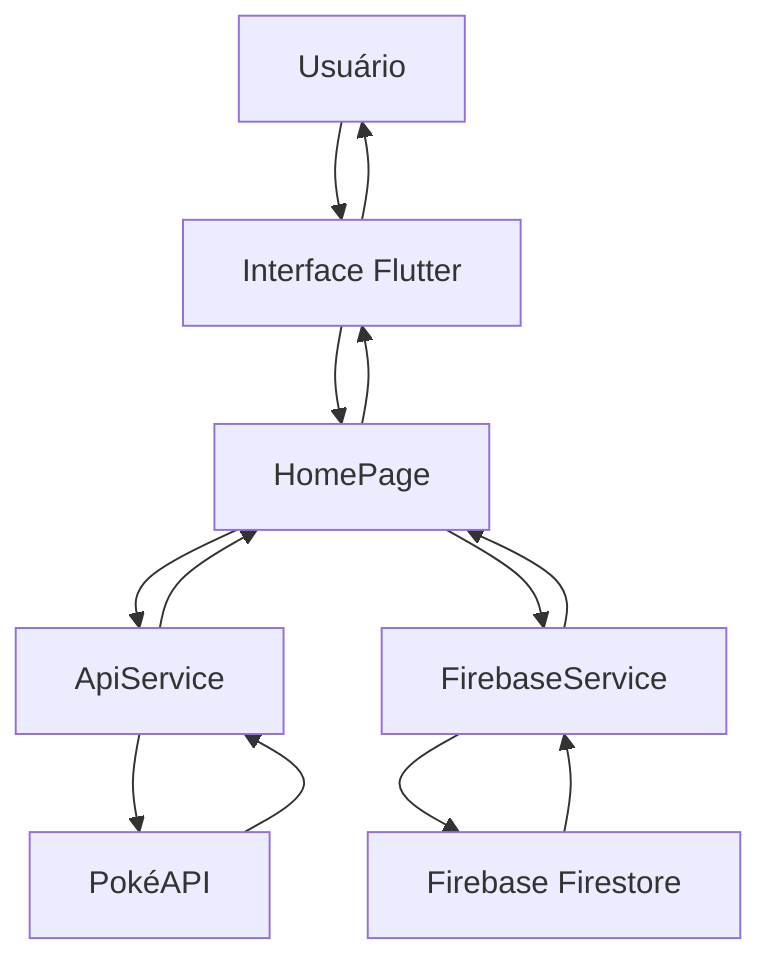

# Pokédex Flutter

Aplicação desenvolvida em Flutter com integração a uma API externa e ao Firebase Firestore. O projeto apresenta uma Pokédex simples e funcional, permitindo listar Pokémons, pesquisar por nome, visualizar imagem e salvar Pokémons favoritos no banco de dados em nuvem.

Este projeto foi desenvolvido como atividade prática com o objetivo de demonstrar o consumo de API em uma aplicação Flutter, a organização do código em serviços e a integração com Firebase para persistência de dados.

## Objetivo do projeto

O objetivo principal da aplicação é criar uma Pokédex utilizando Flutter, consumindo dados da PokéAPI e armazenando os Pokémons favoritos no Firebase Firestore.

Com isso, o projeto trabalha conceitos importantes de desenvolvimento mobile, como:

- Consumo de API REST
- Manipulação de dados em formato JSON
- Criação de interface com Flutter
- Separação de responsabilidades no código
- Integração com Firebase
- Persistência de dados em banco NoSQL
- Versionamento do código no GitHub

## Funcionalidades

A aplicação possui as seguintes funcionalidades:

- Listagem de Pokémons consumidos diretamente da PokéAPI
- Exibição do nome e da imagem de cada Pokémon
- Campo de pesquisa para filtrar Pokémons pelo nome
- Opção de favoritar e desfavoritar Pokémons
- Salvamento dos favoritos no Firebase Firestore
- Interface simples, organizada e responsiva
- Integração entre Flutter, API externa e Firebase

## Tecnologias utilizadas

- Flutter
- Dart
- FlutLab
- PokéAPI
- Firebase
- Cloud Firestore
- Git
- GitHub

## API utilizada

A aplicação consome dados da PokéAPI, uma API pública que fornece informações sobre Pokémons.

Endpoint utilizado:

```text
https://pokeapi.co/api/v2/pokemon
```

A partir desse endpoint, o aplicativo busca os dados dos Pokémons e utiliza as informações retornadas para montar a listagem exibida na tela.

## Integração com Firebase

O Firebase Firestore foi utilizado para armazenar os Pokémons marcados como favoritos.

Quando o usuário favorita um Pokémon, os dados principais são enviados para o Firestore. Quando o usuário remove o favorito, o registro correspondente também pode ser removido ou atualizado, dependendo da lógica aplicada no serviço Firebase.

Coleção utilizada:

```text
favoritos
```

Estrutura básica dos dados salvos:

```json
{
  "nome": "pikachu",
  "imagem": "url_da_imagem",
  "favoritadoEm": "timestamp"
}
```

## Organização do projeto

O projeto foi organizado separando a interface, os modelos e os serviços responsáveis pela comunicação com a API e com o Firebase.

Principais arquivos utilizados:

```text
main.dart
api_service.dart
firebase_service.dart
pokemon.dart
firebase_options.dart
```

Descrição dos arquivos:

| Arquivo | Função |
|---|---|
| main.dart | Arquivo principal da aplicação. Inicializa o Firebase e carrega a tela inicial da Pokédex. |
| api_service.dart | Responsável por fazer as requisições para a PokéAPI. |
| firebase_service.dart | Responsável por salvar, buscar ou remover Pokémons favoritos no Firestore. |
| pokemon.dart | Modelo de dados utilizado para representar um Pokémon dentro da aplicação. |
| firebase_options.dart | Arquivo de configuração gerado pelo Firebase para conectar o app ao projeto Firebase. |

## Arquitetura da aplicação

A arquitetura da aplicação segue uma estrutura simples, separando a camada de interface, a camada de serviços e as fontes externas de dados.



## Explicação da arquitetura

O usuário interage com a interface desenvolvida em Flutter. A tela principal da aplicação, representada pela HomePage, é responsável por exibir os Pokémons, realizar a pesquisa e permitir que o usuário favorite ou remova Pokémons dos favoritos.

Para buscar os Pokémons, a HomePage utiliza o ApiService, que faz a comunicação com a PokéAPI. Os dados retornados pela API são tratados e exibidos na interface.

Para salvar os favoritos, a HomePage utiliza o FirebaseService, que realiza a comunicação com o Firebase Firestore. Assim, os Pokémons favoritados ficam registrados em uma base de dados em nuvem.

## Fluxo de funcionamento

1. O usuário abre o aplicativo.
2. O Flutter inicializa a aplicação e conecta o projeto ao Firebase.
3. A HomePage solicita a lista de Pokémons ao ApiService.
4. O ApiService busca os dados na PokéAPI.
5. Os Pokémons são exibidos na tela com nome e imagem.
6. O usuário pode pesquisar um Pokémon pelo nome.
7. O usuário pode favoritar um Pokémon.
8. O FirebaseService salva o Pokémon favoritado no Firestore.
9. O usuário pode desfavoritar o Pokémon, atualizando os dados salvos.

## Como executar o projeto

Clone o repositório:

```bash
git clone https://github.com/filipeoliveiradavid/Pokedex-flutter.git
```

Acesse a pasta do projeto:

```bash
cd Pokedex-flutter/pokedex
```

Instale as dependências:

```bash
flutter pub get
```

Execute o projeto:

```bash
flutter run
```

## Execução pelo FlutLab

Este projeto também pode ser utilizado no FlutLab. Para isso, basta importar o projeto no ambiente, conferir as dependências no arquivo `pubspec.yaml` e executar a aplicação pelo próprio botão de execução da plataforma.

## Prints da aplicação

### Tela inicial da Pokédex


### Busca funcionando


### Pokémon favoritado


### Firebase com dados salvos

Antes:


Depois:


## O que foi desenvolvido

Durante o desenvolvimento do projeto, foi criada uma aplicação Flutter capaz de consumir dados externos de uma API pública e também salvar informações no Firebase Firestore.

A aplicação foi estruturada para separar melhor as responsabilidades. A parte visual fica concentrada na interface Flutter, o consumo da API fica no serviço `ApiService`, a comunicação com o Firebase fica no `FirebaseService` e os dados dos Pokémons são representados por um modelo próprio.

Com isso, o projeto atende aos principais requisitos solicitados: uso de Flutter, consumo de API, integração com Firebase, código versionado no GitHub, explicação das tecnologias utilizadas, prints da aplicação e desenho da arquitetura.

## Possíveis melhorias futuras

- Criar uma tela específica para detalhes de cada Pokémon
- Exibir tipo, altura, peso e habilidades
- Criar uma tela exclusiva para favoritos
- Melhorar a identidade visual da interface
- Gerar APK para instalação em dispositivos Android
- Publicar uma versão web para testes online

## Autor

Desenvolvido por Filipe Oliveira David.
